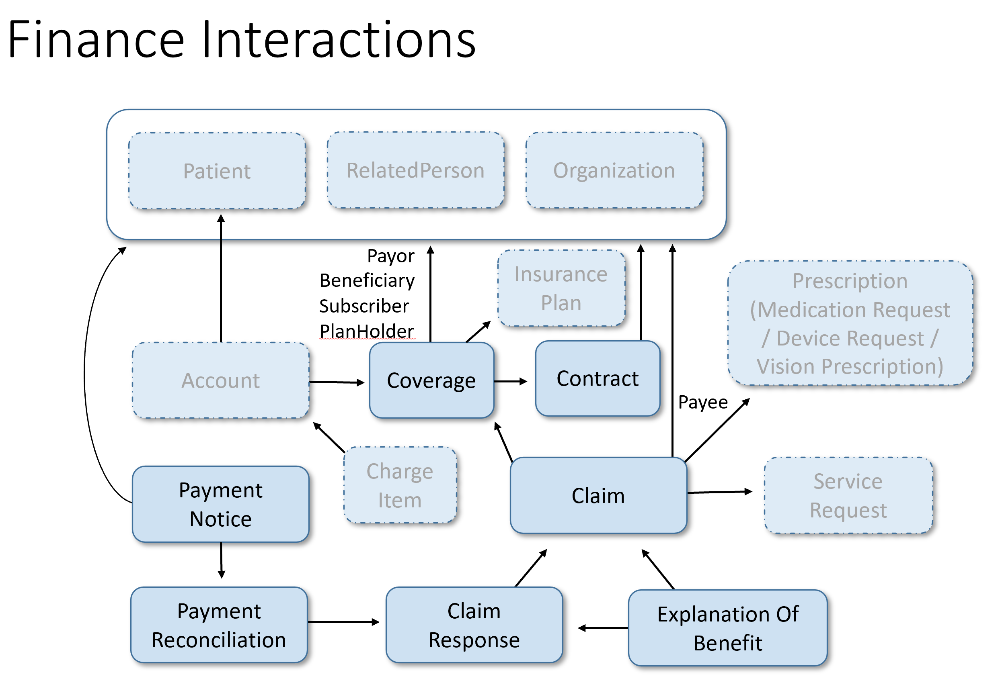

# Account Resource:
- A financial tool for tracking value accrued for a particular purpose. 
- In the healthcare field, used to track charges for a patient, cost centers, etc.

## Scope and Usage:
- The Account resource acts as a central record against which charges, payments, and adjustments are applied. 
- It contains information about which parties are responsible for payment of the account.

## Boundaries and Relationships
- The Account itself does not include information about the charges, payments or adjustments, 
- but rather those resources, such as ChargeItem point to the account to which they apply.
 
## Background and Context
- The Account resource can be considered a "bucket" to which ChargeItem resources are linked. 
- These charges are processed by a billing system, which determines the responsible parties for the balance of the account. 
- The billing system then submits claims or sends statements to the appropriate parties.
- Once payment is received, an adjustment is applied to the Account. 
- The internal calculation of balances and allocation of responsibility is expected to be internal to the billing systems. 
- Only the inputs and outputs of the billing process is communicated in the relevant financial FHIR resources.

# NB: We are the "BILLING SYSTEM" in this context. 

SEE THE IMAGE BELOW FOR THE FLOW PROCESS:

To achieve the goal of linking patients to their respective accounts and ultimately handling charges and payments, 
we can break down the task into the following steps:

1. Pull Account Resources from FHIR Server:
   - Create DTOs to represent the Account resource. 
   - Create a service to fetch accounts from the FHIR public test server and map them to the DTOs.

2. Link Patients to Accounts:
   - Determine the appropriate field (e.g., patient ID) to link patients to accounts. 
   - Update the patient entities in the database to include a accountReference to the associated account.

3. Save Accounts to Database:
   - Create an entity class for the Account resource. 
   - Implement a service to save the accounts to the database. 
   - Ensure the relationship between patients and accounts is maintained.

4. Handle ChargeItems:
   - After linking patients and accounts, proceed to handle ChargeItem resources. 
   - Ensure that ChargeItems point to the correct Account and can update the Account balance and status