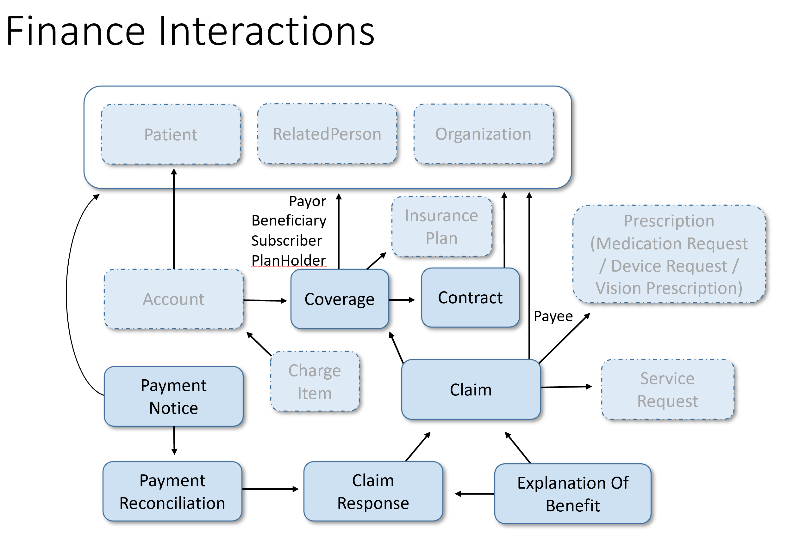

Patient Resource:
Purpose: To get demographic and identifying information about patients.
Usage: We'll use this resource to pull basic patient information, including names, identifies, contact details, etc.

Account Resource:
Purpose: To track financial information related to a patient.
Usage: We'll use this resource to get details about patient accounts, including the balance, account status, and any relevant identifies.

ChargeItem Resource:
Purpose: To detail individual charges on a patient's account.
Usage: We'll use this resource to pull information about specific charges, such as the type of charge, amount, and date.

Invoice Resource:
Purpose: To represent billing statements sent to patients.
Usage: We'll use this resource to retrieve information about invoices, including the total amount due, itemized charges, and payment instructions.

PaymentNotice Resource:
Purpose: To notify about payments made and processed.
Usage: We'll use this resource to get information about payments, including the date, amount, and method of payment.

PaymentReconciliation Resource:
Purpose: To provide details about payment reconciliation.
Usage: We'll use this resource to ensure that payments are correctly reconciled with the charges and invoices.

Claim Resource:
Purpose: To request payment for services provided.
Usage: We'll use this resource to pull information about claims submitted for patient services, including the service details and amounts claimed.

ClaimResponse Resource:
Purpose: To provide responses to claims.
Usage: We'll use this resource to get information about the adjudication of claims, including approved amounts and adjustments.

Coverage Resource:
Purpose: To provide insurance accountCoverage details.
Usage: We'll use this resource to retrieve information about the patient's insurance accountCoverage, including the plan details and accountCoverage limits.

ExplanationOfBenefit Resource:
Purpose: To summarize benefits provided.
Usage: We'll use this resource to get detailed information about the benefits provided to the patient, including costs and patient responsibility.

To understand the Financial Transaction better, we can use the following diagram:
